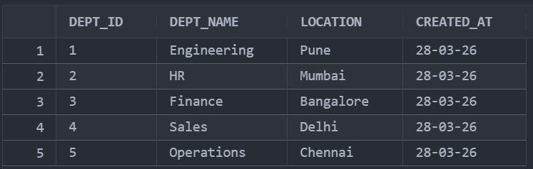
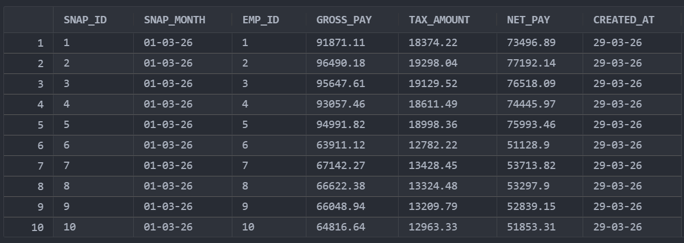
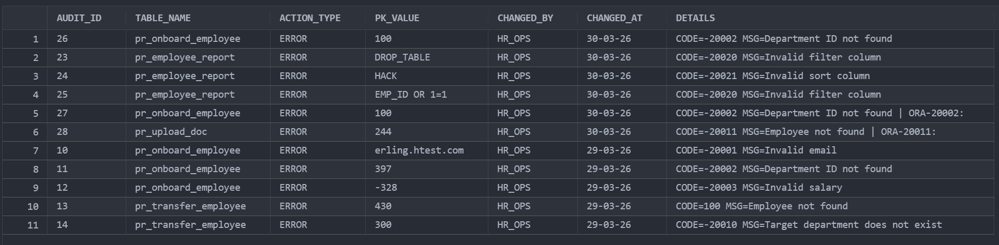
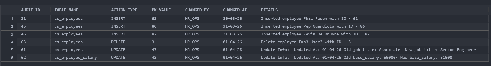
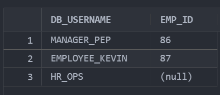

# HR Ops Automation Suite

## Overview

The HR Ops Automation Suite is a comprehensive Oracle database application designed to manage employee data, payroll, transfers, documents, and security policies. It includes tables, packages, triggers, VPD (Virtual Private Database) policies, and tests to ensure robust HR operations.

## Compilation Order

All SQL files must be compiled as the `hr_ops` user, who serves as the HR admin user. The compilation order is critical to ensure dependencies are resolved correctly:

1. **hr_ops_admin_setup.sql**: Sets up the `hr_ops` user with necessary privileges, including grants for creating sessions, tables, views, procedures, triggers, roles, contexts, and users. Also grants execute on `DBMS_RLS` (requires SYS/SYSTEM privileges).

2. **01_ddl.sql**: Creates all database tables (e.g., `cs_departments`, `cs_employees`, `cs_employee_salary`, `cs_transfers`, `cs_payroll_snapshot`, `cs_audit_log`, `cs_employee_docs`, `cs_user_identity`), indexes for optimization, roles (`role_hr_admin`, `role_manager`, `role_employee`), and users with role assignments.

3. **02_seed.sql**: Inserts seed data into the tables, including departments, employees, salaries, and user identities.

4. **03_packages.sql**: Defines packages and procedures, including `pkg_error` for exception handling, `pkg_hr_ops` for core HR operations (e.g., onboarding, payroll generation with cursor and bulk collect variants, transfers, document uploads), and `pkg_hr_security` for VPD context.

5. **04_triggers.sql**: Creates triggers for auditing changes to employee and salary data, logging to `cs_audit_log`, and setting login contexts.

6. **05_vpd.sql**: Implements Virtual Private Database policies to restrict access to salary data based on user roles.

7. **06_tests.sql**: Contains test scripts to validate functionality, including VPD tests that must be run as different users.

**Note**: The `07_views.sql` file is not included in the compilation order as it demonstrates view and procedure validity based on compile order and underlying table dependencies. It should be compiled separately to illustrate how views become invalid if tables are not yet created.

## Architecture

The suite uses a modular architecture with:
- **Tables**: Core data storage for departments, employees, salaries, transfers, payroll snapshots, audit logs, documents, and user identities.
- **Packages**: Encapsulate business logic, including HR operations (`pkg_hr_ops`), error handling (`pkg_error`), and security (`pkg_hr_security`).
- **Triggers**: Automate auditing and data updates.
- **VPD Policies**: Enforce row-level security on sensitive data like salaries.
- **Roles and Users**: Define access levels via roles assigned to users linked through `cs_user_identity`.
- **Views and Procedures**: In `07_views.sql`, demonstrate dependency management (e.g., `vw_emp_payroll_latest` and `pr_emp_payroll_latest`).

The application leverages Oracle packages like `DBMS_OUTPUT` for output, `DBMS_LOB` for large object handling, `DBMS_SESSION` for session management, and `DBMS_RLS` for row-level security.

## Exception Strategy

Error handling is centralized using the `pkg_error` package, which defines custom exceptions (e.g., `ex_invalid_email`, `ex_dept_not_found`, `ex_invalid_salary`, `ex_target_dept_not_found`, `ex_employee_not_found`, `ex_invalid_filter_column`, `ex_invalid_sort_column`). The `pr_log_error` procedure uses an autonomous transaction to log errors to the `cs_audit_log` table without affecting the main transaction. This ensures audit trails are maintained even during failures.

## Performance Approach

Performance is optimized through:
- **Indexes**: Created in `01_ddl.sql` on frequently queried columns (e.g., `idx_emp_dept` on `cs_employees(dept_id)`, `idx_payroll_emp` on `cs_payroll_snapshot(emp_id)`, `idx_transfers_emp` on `cs_transfers(emp_id)`) to speed up joins and lookups.
- **Payroll Calculators**: Two variants in `pkg_hr_ops`:
  - Row-by-row cursor version (`pr_generate_payroll`).
  - Bulk collect with FORALL version (`pr_generate_payroll_bulk`) for better performance on large datasets.
- Efficient queries and bulk operations reduce I/O and improve scalability.

## Dynamic SQL Injection Protection

The `pr_employee_report` procedure in `pkg_hr_ops` protects against SQL injection by:
- Using a safe list of allowed filter and sort columns.
- Employing prepared statements with bind variables instead of string concatenation.
- Validating inputs against predefined lists to prevent malicious column names or values.

## Security and Access Control

- **VPD (Virtual Private Database)**: Restricts access to `cs_employee_salary` based on roles:
  - `HR_ADMIN`: Full access.
  - `MANAGER`: Access to their direct reports' salaries.
  - `EMPLOYEE`: Access only to their own salary.
- **Roles**:
  - `role_hr_admin`: Full CRUD on salaries.
  - `role_manager`: Read-only on salaries.
  - `role_employee`: Read-only on salaries.
- **User Setup**: Users are created and linked via `cs_user_identity` table, mapping database usernames to employee IDs. Example users: `hr_ops` (admin), `manager_pep` (manager), `employee_kevin` (employee).
- **Triggers**: Log all changes to employee data in `cs_audit_log` for compliance and auditing.

## Views and Compile Order Demonstration

The `07_views.sql` file creates `vw_emp_payroll_latest` (a view joining employees and payroll snapshots) and `pr_emp_payroll_latest` (a procedure using the view). This demonstrates how database objects become valid or invalid based on dependencies:
- If compiled before DDL (tables), the view and procedure will be invalid until tables exist.
- Compile order affects object status: Views depend on underlying tables, so DDL must precede view creation for validity.
- Procedures referencing views will also be invalid if the view is invalid.

## Testing

The `06_tests.sql` file includes comprehensive tests for procedures, functions, triggers, and VPD policies. To execute:
1. Run as `hr_ops` user for most tests.
2. For VPD tests, switch users:
   - Connect as `manager_pep` (password: `manager123`) to test manager access.
   - Connect as `employee_kevin` (password: `employee123`) to test employee access.
   - `hr_ops` user tests admin access.
3. Use `SET SERVEROUTPUT ON` and execute blocks to view results.
4. Check `cs_audit_log` for logged events.

Ensure all prior files are compiled before running tests to avoid dependency errors.

## Screenshots

Departments Table

Payroll Snapshots Table

Audit Log Table - Errors View

Audit Log Table - Updates View

User Identity Table

